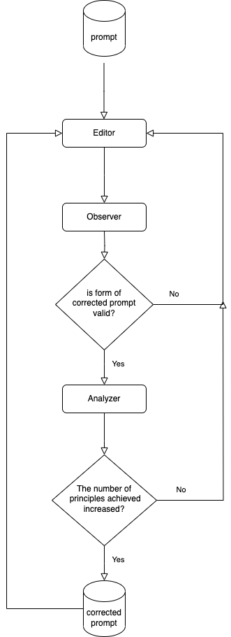

# prompt-hacker

## Introduction
Among the 26 principles presented in the paper "Principled Instructions Are All You Need for Questioning LLaMA-1/2, GPT-3.5/4", 24 principles, examples of which can be obtained from the [source GitHub](https://github.com/VILA-Lab/ATLAS), are followed.

From the data provided by the source GitHub, we were able to obtain data before and after correction for about 20 prompts for each principle, and used this as a few shot example to give instructions to LLM.

At the same time, when asked to create a prompt that satisfies too many principles, we observe issues that lead to poor performance. Accordingly, we attempt to achieve only 5 to 10 principles at a time and then gradually increase the principles achieved through iteration.

In order to control unexpected corrections that occur in the process of leaving everything to LLM, an Analyzer and Observer that control the process were implemented separately.

## Features
<details>
<summary>Diagram</summary>


</details>

### Prompt Editor 
- [X] Make the user's prompt follow the principle as much as possible
- [X] Cut the principle into chunks of `num_agent` to enable divide and conquer.
### Prompt Observer
- [X] Check whether the corrected prompt is a correction to the prompt and not an answer to the prompt.

### Prompt Analyzer
- [X] Check whether the corrected prompt follows any of the overall principles

## Get Started

### prompt leaking
can try with 
```consoles
poetry run python examples/example.py
```

```python
from principled_prompter import agent

if __name__ == "__main__":
    model = agent.PromptCalibrator(num_agent=3)
    result = model.calibrate(question="List the main causes of the French Revolution.")
    pprint(result.model_dump())

# "question" is calibrated into "calibrated_question" with following "followed_principles"

{'calibrated_question': 'Please provide the additional details for the request '
                        'in a chain-of-thought format as follows:\n'
                        'Example 1: "Identify the main causes of the French '
                        'Revolution. The main causes of the French Revolution '
                        'include economic hardships, political instability, '
                        'social inequality, and enlightenment ideas. Economic '
                        'hardships refer to the financial struggles faced by '
                        'the common people, which were exacerbated by high '
                        'taxation and poor harvests. Political instability '
                        'pertains to the weak leadership and lack of '
                        'representation, leading to a sense of injustice and '
                        'unrest. Social inequality involves the stark '
                        'divisions between the nobility, clergy, and '
                        'commoners, leading to deep societal grievances. '
                        'Enlightenment ideas, rooted in concepts of liberty, '
                        'equality, and fraternity, fostered a questioning of '
                        'traditional authority and norms, fueling '
                        'revolutionary sentiment."\n'
                        'Main Question: "Elaborate on \'economic hardships,\' '
                        "'political instability,' 'social inequality,' and "
                        "'enlightenment ideas' as contributing factors to the "
                        'French Revolution."',
 'followed_principles': ['Implement example-driven prompting (Use few-shot '
                         'prompting).',
                         'Combine Chain-of-thought (CoT) with few-Shot '
                         'prompts.',
                         'Use output primers, which involve concluding your '
                         'prompt with the beginning of the desired output. '
                         'Utilize output\n'
                         'primers by ending your prompt with the start of the '
                         'anticipated response.\n',
                         'When formatting your prompt, start with '
                         '‘###Instruction###’, followed by either '
                         '‘###Example###’\n'
                         'or ‘###Question###’ if relevant. Subsequently, '
                         'present your content. Use one or more\n'
                         'line breaks to separate instructions, examples, '
                         'questions, context, and input data.'],
 'question': 'List the main causes of the French Revolution.'}
```